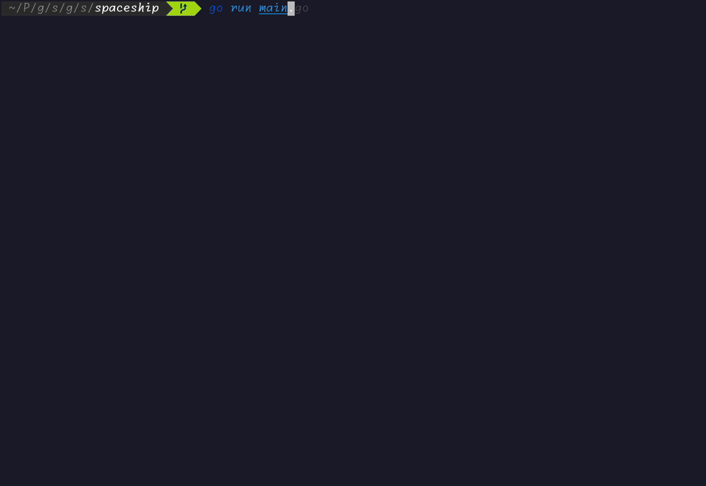

# Spaceship

This little program emulates a simple game I made in high school on a graphics calculator.

The purpose of this project is to act as a fun way to learn Golang as well as tools made by [Charm](https://charm.sh/), like `bubbletea` and `lipgloss`.
